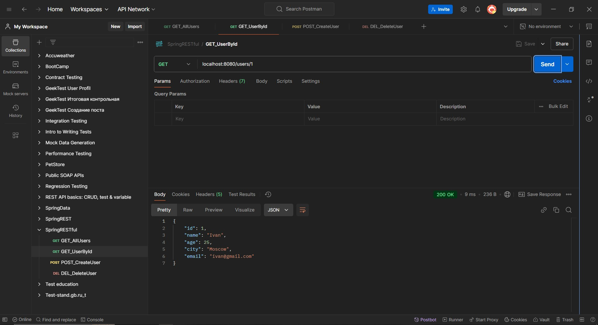

# Урок 6.
Проектирование и реализация API для серверного приложения.

Задание:
Используя Spring, разработайте REST ful API для вашего приложения.
Ваш API должен включать операции для создания, чтения, обновления и удаления пользователей.

==========================================================================================

## Демонстрация решения:

### Swagger:

    http://localhost:8080/swagger-ui/index.html 

------------------------------------------------------------------------------------------
### Postman: 

